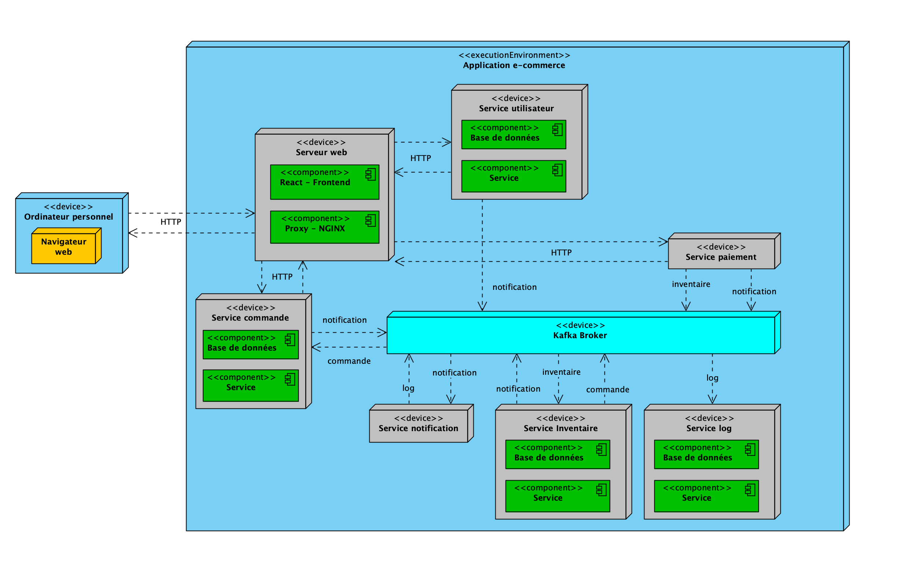

## Architecture orientée événements (Kafka)

Application de démonstration d’une architecture orientée événements pour une plateforme e‑commerce simplifiée. Les microservices communiquent exclusivement via Kafka; aucune communication directe n’est effectuée entre services.

## 1. Objectif

- Mettre en place un système distribué où chaque service publie/consomme des événements Kafka.
- Montrer un stimulus manuel (requêtes HTTP) et un effet observable (logs centralisés en temps réel).

## 2. Architecture et services

### Schéma architecture



Services (conteneurs Docker) principaux:

- logs-service (Go, WebSocket, port 3000)
  - Consomme `log` et diffuse les lignes en temps réel via WebSocket.
- users-service (Go, REST, port 3001, MongoDB)
  - Endpoints: `POST /register`, `POST /login`.
  - Produit sur `notifications` (ex. “User X registered successfully”).
- notifications-service (Go, worker)
  - Consomme `notifications`.
  - Produit des entrées sur `logs` (traçabilité globale).
- payments-service (Go, REST, port 3002)
  - Endpoint: `POST /pay`.
  - Produit sur `notifications` et `inventories` (simulation orchestrée par paiement).
- Kafka et Zookeeper
  - Kafka UI exposée sur `http://localhost:8080` (consultation des topics et messages).
- MongoDB (users-service-database)
  - Base dédiée au service utilisateurs (découplage par service).

Schéma logique des topics:

- `notifications` (produit par users/paiements → consommé par notifications → re‑publié en logs)
- `logs` (produit par notifications → consommé par logs-service → visible en temps réel)
- `inventories` (produit par paiements; consommateur à implémenter ultérieurement)

## 3. Ports et endpoints

- Kafka UI: `http://localhost:8080`
- logs-service (WebSocket): `ws://localhost:3000/`
- users-service API: `http://localhost:3001`
  - `POST /register` (body de formulaire: `username`, `password`)
  - `POST /login` (body de formulaire: `username`, `password`) → retourne un token JWT de test
- payments-service API: `http://localhost:3002`
  - `POST /pay`

Remarques techniques:

- Kafka est configuré avec `KAFKA_AUTO_CREATE_TOPICS_ENABLE=true`, donc les topics manquants sont créés à la volée.
- `kafka-init` crée au démarrage: `logs`, `notifications`.

## 4. Prérequis

- Docker
- Docker Compose

Rien d’autre n’est requis localement (Go, Kafka, MongoDB s’exécutent en conteneurs).

## 5. Lancement rapide

1. Démarrer l’environnement:

```bash
docker-compose up -d --build
```

2. Vérifier l’état:

```bash
docker-compose ps
```

3. Ouvrir Kafka UI: `http://localhost:8080`

## 6. Déclencher le stimulus (actions HTTP)

Exemples avec curl:

- Inscription utilisateur (users-service → produit un événement sur `notifications`):

```bash
curl -X POST -d "username=alice&password=secret" http://localhost:3001/register
```

- Connexion (users-service → produit un événement sur `notifications`, retourne un JWT de test):

```bash
curl -X POST -d "username=alice&password=secret" http://localhost:3001/login
```

- Paiement (payments-service → produit des événements sur `inventories` et `notifications`):

```bash
curl -X POST http://localhost:3002/pay
```

## 7. Détails techniques par service

- users-service

  - Expose `POST /register` et `POST /login`.
  - Persistance dans MongoDB (`users-service-database`).
  - Publie un événement “notification” (JSON) sur `notifications` pour chaque action réussie.
  - Génère un JWT de test côté `/login` (clé et expiration codées en dur, pour démonstration).

- notifications-service

  - Consomme `notifications`.
  - Écrit une trace structurée (JSON) sur `logs`.

- logs-service

  - Consomme `logs`.
  - Sert un flux WebSocket qui pousse chaque log reçu aux clients connectés.

- payments-service
  - Expose `POST /pay`.
  - Publie sur `inventories` (simulation réserve/MAJ de stock) et `notifications` (confirmation).

## 8. Tests rapides (copier/coller)

```bash
# 1) Démarrer l’environnement
docker-compose up -d --build

# 2) Regarder les logs en temps réel
docker-compose logs -f notifications-service &
docker-compose logs -f logs-service &

# 3) Stimulus
curl -X POST -d "username=bob&password=pass123" http://localhost:3001/register
curl -X POST -d "username=bob&password=pass123" http://localhost:3001/login
curl -X POST http://localhost:3002/pay
```

Vous devriez voir des événements apparaître d’abord côté `notifications-service`, puis des lignes consolidées côté `logs-service`.

## 9. Arrêt et nettoyage

```bash
docker-compose down
```

Pour supprimer les volumes (données MongoDB, etc.):

```bash
docker-compose down -v
```
